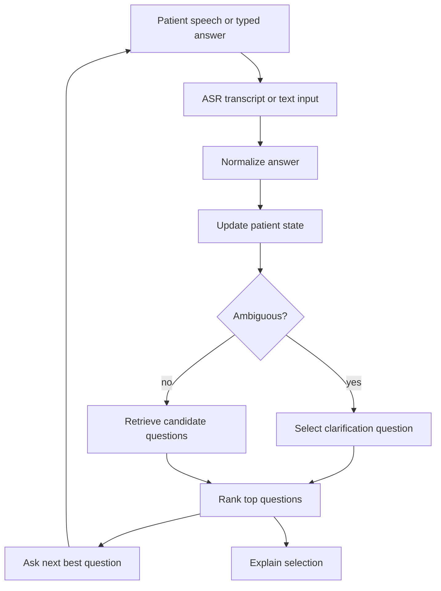

# Adaptive Questioning Design

## Product Goal

The system does not diagnose. It identifies the most useful next question to reduce ambiguity and fill missing previsit history.

Chinese demo wording:

> 系統不做診斷，而是根據病人已經回答的內容，找出最能減少模糊性的下一題。

## First Principle

The real previsit problem is not that patients need an AI doctor. The real problem is that patient language is often incomplete, imprecise, and hard to convert into a useful clinical history.

V2 should help convert vague patient speech into structured previsit information useful for clinician review.

## Six-Layer Architecture

```text
Layer 1: Input Layer
ASR transcript or typed fallback

Layer 2: Transcript Normalization Layer
Clean and tokenize patient language

Layer 3: Patient State Layer
Track known symptoms, answered slots, missing slots, and ambiguity flags

Layer 4: Question Bank Layer
Governed urology questions with metadata

Layer 5: Retrieval and Ranking Layer
Embedding-style similarity + rule constraints + gap scoring

Layer 6: Explanation Layer
Show why the next question was selected and why others were downranked
```

## Runtime Flow



## Current Implementation

Runtime code lives in:

```text
core/adaptive_questioning/
  questionBank.js
  extractFacts.js
  detectAmbiguity.js
  scoring.js
  rankQuestions.js
  constants.js
  normalize.js
  state.js
  ambiguity.js
  retrieve.js
  rank.js
  explain.js
  index.js

data/question_bank/
  urology_adaptive_bank.js
```

The browser demo lives in:

```text
app/adaptive-intake/
  index.html
  adaptive-intake.js
  adaptive-intake.css
```

## Question Bank Contract

Each exported question should expose:

```js
{
  id,
  text,
  type,
  asksFor,
  symptoms,
  domain,
  clinicalValue,
  ambiguityReduction,
  safetyPriority,
  redFlag,
  nextUsefulWhen,
  avoidWhen,
  answerType,
  options,
  explanationTemplate
}
```

## Ranking Formula

The deterministic scoring formula is:

```text
score =
  semantic_similarity * 0.40
+ unanswered_gap_value * 0.25
+ clinical_workflow_value * 0.20
+ ambiguity_reduction * 0.10
+ safety_priority * 0.05
- already_answered_penalty
- dependency_penalty
- ambiguity_penalty
- out_of_scope_penalty
```

## Demo Cases

### Case A: Nocturia / Frequency

Patient says:

```text
I wake up several times at night to pee.
```

Expected behavior:

```text
nocturia -> quantification -> duration -> associated symptoms -> red-flag boundary checks
```

### Case B: Dysuria / Infection-Like Concern

Patient says:

```text
It burns when I pee.
```

Expected behavior:

```text
dysuria -> duration or pain follow-up -> urinary frequency -> systemic symptoms -> safety boundary
```

### Case C: Vague Pain

Patient says:

```text
I feel pain down there.
```

Expected behavior:

```text
vague complaint -> location clarification -> timing -> associated symptoms -> safety boundary
```

This is the strongest V2 demo case because it shows that the system does not over-trust similarity when patient wording is unclear.
