# 📄 基於 AI 輔助的泌尿科門診前問診與醫師摘要系統 -- 臨床應用展示

展示用途：2026-04-23 醫師討論用  
系統階段：合成資料 MVP demo，尚非正式臨床系統  
核心定位：整理病人回報、補齊關鍵缺漏、協助醫師快速掌握門診前資訊；不做診斷、分流或治療建議。

---

# 1️⃣ 臨床問題與需求背景（Clinical Need）

泌尿科門診常見的困難，不是單一檢查數值不夠，而是病人進診間前，關鍵病史常常還沒有被有系統地整理好。頻尿、夜尿、急尿、漏尿、排尿困難、血尿、尿痛、發燒畏寒、用藥狀況等資訊，臨床上都很重要，但在實際門診流程中，常會遇到幾個痛點：

- 病人不一定能在短時間內清楚描述症狀，特別是年長者、緊張者、或覺得漏尿/排尿問題尷尬的病人。
- 家屬常協助回答，但「病人本人感受」與「家屬觀察」若混在一起，醫師需要再花時間釐清。
- 藥單、夜尿次數、漏尿情境、是否發燒畏寒或血尿等資訊常不完整，護理師與醫師可能需要重複補問。
- 醫師需要的是可快速掃讀的病史摘要，而不是冗長的問卷紀錄。

從 guideline 的角度來看，泌尿症狀的初始評估本來就高度依賴病史、症狀型態、困擾程度、用藥脈絡、尿液檢查與必要時的後續檢查。例如 NICE 對男性下泌尿道症狀建議初始評估包含一般病史、目前用藥檢視、頻率/尿量紀錄與尿液 dipstick；NICE 對女性尿失禁/膀胱過動症也建議初始評估使用 bladder diary，並在治療評估時使用 validated symptom / quality-of-life questionnaire。AUA/SUFU 對膀胱過動症、血尿、反覆泌尿道感染與 BPH/LUTS 的 guideline 也同樣把診斷與檢查判讀保留給臨床端。

因此，本系統要解決的不是「讓 AI 替醫師判斷」，而是把門診前最容易漏掉、最容易重複問、也最需要來源標記的資訊，先整理成臨床可讀的形式。

圖 1：門診前痛點如何轉成可用的臨床摘要。

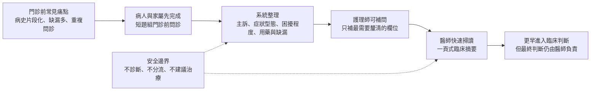

---

# 2️⃣ 系統概念與臨床價值（Clinical Value Proposition）

這是一個泌尿科門診前的 guided previsit workflow。病人或家屬在看診前，用簡單、分段、可協助操作的方式回答泌尿症狀相關問題；系統會保留每個重要答案的來源，找出缺漏資訊，讓護理師可以針對缺漏補問，最後產生醫師可在一分鐘內掃讀的摘要。

它的臨床價值主要有三點：

- 提前整理風險訊號與病史脈絡：例如可見血尿、發燒畏寒、腰側痛、目前尿不出來、藥單不完整等，不被藏在自由文字裡。
- 減少重複問診與資訊落差：醫師進診間前先看到主訴、時間、困擾程度、症狀型態、缺漏欄位與來源標記。
- 支援病人與家屬表達：對長者、需要大字體/高對比/朗讀輔助者，或由家屬協助操作的病人，提供較低壓力的填答方式。

一句話總結：

> 這個系統在臨床上的角色，是「門診前病史整理與缺漏補齊助手」，讓醫師更快進入有品質的臨床問診，而不是取代醫師判斷。

圖 2：系統在臨床上的角色與明確非目標。

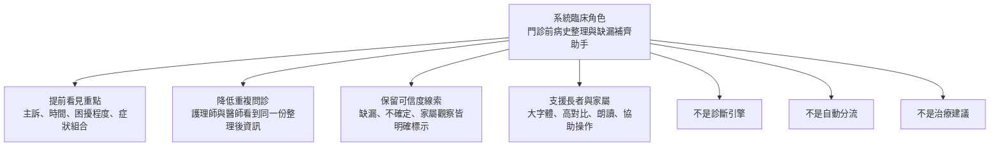

---

# 3️⃣ 系統運作流程（Clinical Workflow Integration）

本 demo 對應的是門診報到後、醫師看診前的資訊整理流程。設計重點是分工清楚，不把病人端、護理端、醫師端混在同一個畫面。

1. 病人進入門診前問診流程
   - 可由病人本人填答，也可由家屬協助操作。
   - 一開始即標記資料來源：本人回答、本人回答但家屬協助操作、家屬觀察、護理補問。

2. 系統引導回答核心泌尿症狀
   - 先問主訴、開始時間、困擾程度。
   - 再依症狀觸發較短的條件模組，例如頻尿/夜尿/急尿、漏尿、排尿困難、血尿、尿痛/感染相關症狀、用藥脈絡。

3. 系統保留缺漏與不確定
   - 病人可以回答「不確定」。
   - 缺漏資訊不會被系統自行補完，也不會被隱藏。

4. 護理師工作台顯示可補問項目
   - 顯示目前缺哪些欄位。
   - 提供具體補問句，例如補藥單、確認漏尿量、確認是否發燒畏寒或腰側痛。
   - 護理端只做資訊補齊與來源確認，不做診斷或分流等級。

5. 醫師看到一頁式 previsit summary
   - 包含主訴、時間、困擾程度、病人回報的症狀型態、缺漏資訊、需要臨床 review 的觀察、答題來源。
   - 醫師可選擇採用、修正或忽略摘要內容。

6. Demo review 收集臨床回饋
   - 醫師與團隊可判斷：這個流程應該繼續、修改、縮小場景，或暫停。

這個 workflow 的重點是「不增加醫師負擔」。醫師不需要操作問卷，也不需要看完整逐題紀錄；系統的輸出應該是短、可掃讀、可質疑、可追溯來源的摘要。

圖 3：門診現場可理解的角色分工流程。

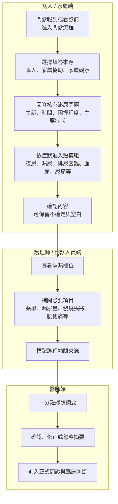

圖 4：答案來源標記如何避免家屬代答與本人感受混淆。

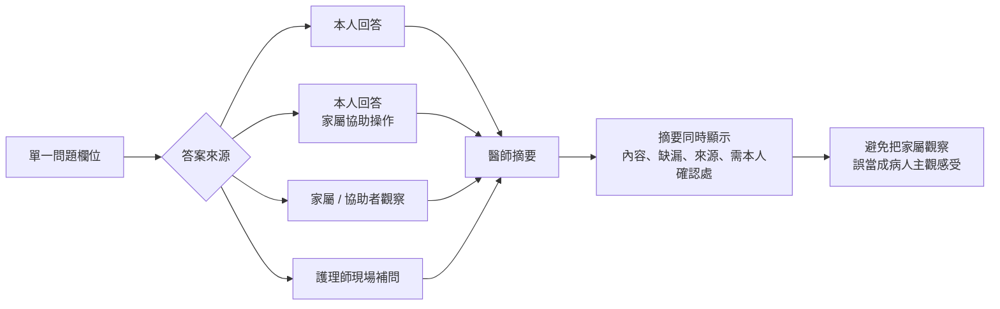

---

# 4️⃣ 判斷依據與醫學合理性（Medical Rationale）

這一段是本系統最重要的可信度基礎：系統的題目與摘要不是讓 AI 自己猜，而是把 guideline 與臨床問診常用概念，轉成可由病人/家屬先回答的格式。

## 4.1 系統整理的是「症狀域」，不是診斷名稱

目前題組依照泌尿科常見症狀域整理：

- Storage symptoms：頻尿、夜尿、急尿。
- Leakage / urinary incontinence：是否漏尿、漏尿頻率、量、誘發情境、是否使用護墊/尿布。
- Voiding / emptying symptoms：尿流弱、需要用力、斷斷續續、尿不乾淨、曾經或目前尿不出來。
- Pain / infection-related context：尿痛、灼熱、發燒、畏寒、腰側痛。
- Hematuria observation：病人是否看到紅色/茶色尿或血塊；不讓病人判斷 microscopic hematuria。
- Medication / context：是否能提供藥單、是否需要護理師協助確認用藥。

這些都是臨床問診會用到的 observation。系統不輸出「疑似 OAB」「疑似 BPH」「疑似 UTI」「血尿高風險」等診斷或風險分層。

圖 5：系統整理的是症狀域與病人回報觀察，不是診斷名稱。

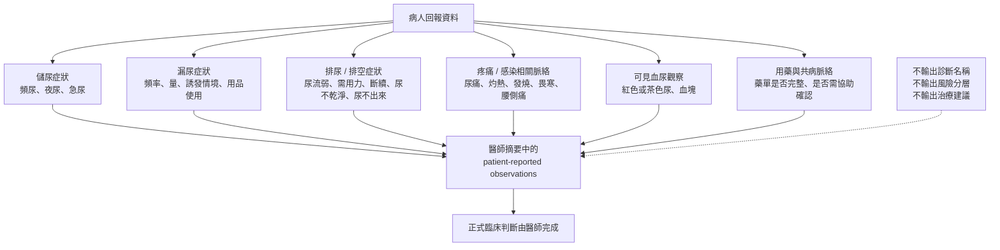

## 4.2 題目設計對應 guideline 與量表概念

- AUA/SUFU OAB guideline 支持初始評估需病史、膀胱症狀、尿液分析，並可使用 symptom questionnaire 或 voiding diary 協助評估。
- NICE CG97 對男性 LUTS 初始評估，明確包含一般病史、目前用藥 review、frequency-volume chart、尿液 dipstick；也提到 IPSS 可作為 baseline symptom score。
- NICE NG123 對女性尿失禁/膀胱過動症，支持 bladder diary、validated UI-specific symptom / quality-of-life questionnaire，以及在 voiding dysfunction 或 recurrent UTI 症狀時評估 post-void residual。
- ICS 對 bladder diary / frequency-volume chart 的定義，支持記錄排尿時間、尿量、fluid intake、pad usage、incontinence episodes、urgency、pain 等欄位。
- ICIQ-UI SF 支持尿失禁的 frequency、amount、quality-of-life impact、self-diagnostic item 等核心 domains。

本 MVP 採取保守做法：可以參考 IPSS、ICIQ、bladder diary 等 domains，但目前不宣稱自己產生正式 IPSS 分數、ICIQ 分數或任何 validated score。若未來正式採用完整量表，需確認授權、正式台灣繁中版本、評分方式與臨床 reviewer approval。

圖 6：醫學依據如何轉成病人可回答、醫師可覆核的題組。

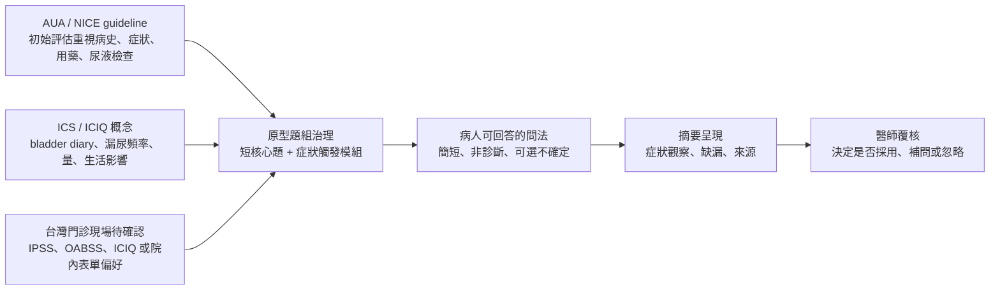

## 4.3 家屬協助不等於混合答案

泌尿症狀中有很多主觀感受，例如急尿、疼痛、困擾程度、尿不乾淨感。家屬可以協助操作，也可以提供觀察，但系統會把來源標記清楚：

- 本人回答。
- 本人回答，家屬協助操作。
- 家屬/協助者觀察。
- 護理師現場補問。

這讓醫師能快速判斷哪些內容需要再向病人本人確認，降低「家屬代答被誤認為病人主觀感受」的風險。

## 4.4 缺漏資訊本身就是臨床資訊

本系統不會把缺漏隱藏。若病人沒有回答症狀開始時間、尿痛、有無發燒畏寒、藥單完整性、漏尿量等欄位，摘要會直接標示缺漏。這對臨床有兩個好處：

- 護理師知道下一個最值得補問的是什麼。
- 醫師知道摘要的可信範圍，不會誤以為資料完整。

---

# 5️⃣ 資料來源與依據（Evidence & Data Basis）

目前 demo 使用的是合成案例，不使用真實病人資料，也不連接 HIS、EMR、EHR、掛號系統或院內訊息系統。

## 5.1 Demo 目前使用的資料類型

- 病人或家屬填答的 previsit 症狀資料。
- 主訴、開始時間、困擾程度。
- 頻尿、夜尿、急尿、漏尿、排尿困難、尿痛、可見血尿、發燒畏寒、腰側痛等 patient-reported observations。
- 用藥清單完整性與是否需要護理協助。
- 語言、字體、操作協助需求。
- 每個重要欄位的答案來源。
- 缺漏欄位與護理補問紀錄。

## 5.2 Demo 內建三個合成臨床情境

- 晚上常起床尿尿：展示 frequency/nocturia/urgency、bladder diary cue、藥單 review cue。
- 尿不太出來：展示 voiding/emptying symptoms 與「需臨床 review 的病人回報」，但不自動分流。
- 漏尿但資料不完整：展示缺漏資訊如何保留，並由護理工作台協助補問。

## 5.3 依據來源

本系統題組與摘要邏輯主要參考：

- AUA/SUFU Idiopathic Overactive Bladder guideline。
- AUA/SUFU Microhematuria guideline。
- AUA/CUA/SUFU Recurrent Uncomplicated UTI in Women guideline。
- AUA BPH/LUTS guideline。
- NICE CG97 Lower Urinary Tract Symptoms in Men。
- NICE NG123 Urinary Incontinence and Pelvic Organ Prolapse in Women。
- ICS bladder diary / frequency-volume chart terminology。
- ICIQ-UI SF 與 ICIQ bladder diary domains。
- AHRQ / CDC health literacy 與 FDA human factors 對可理解性、使用錯誤風險與人因安全的設計原則。

報告中的證據用途是「支持題目域與安全邊界」，不是宣稱本 MVP 已完成臨床效度驗證。

圖 7：資料來源、醫學依據與黑箱邊界。

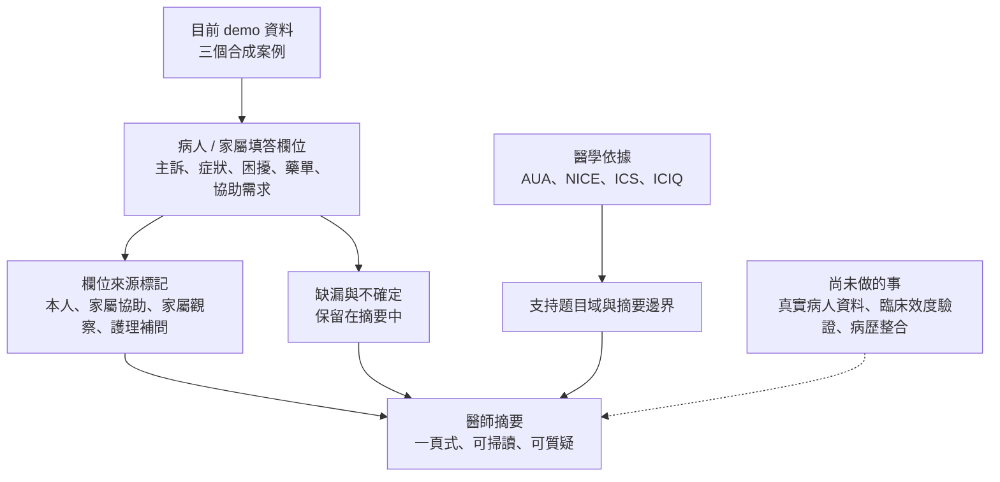

---

# 6️⃣ 風險與安全設計（Risk & Safety Consideration）

本系統必須以保守、安全、可追溯為原則。它不是醫師替代品，也不是自動診斷、分流或治療系統。

## 6.1 主要風險

- False positive：系統把某些回報顯示為需 review，可能增加護理或醫師注意成本。
- False negative：病人沒填、填錯、或家屬不知道，可能導致重要症狀沒有被捕捉。
- 來源混淆：家屬觀察若被誤認為病人本人感受，可能影響後續問診。
- 過度信任摘要：醫師若把摘要當成完整病史，可能忽略仍需臨床確認的內容。
- 隱私與法規風險：若未來使用真實病人資料，需符合院內資安、個資、病歷、醫療器材軟體與資料治理要求。

## 6.2 對應控制措施

- 只提供提醒與整理，不提供診斷、治療建議或自動分流等級。
- 所有摘要都標示「clinician review required」。
- 缺漏資訊保持可見，不由系統自動推測。
- 家屬、病人、護理補問的來源分開標示。
- 護理端只顯示補問與工作 cue，不顯示診斷標籤或治療命令。
- 醫師端只顯示 patient-reported observations 與 missing information。
- Demo 階段只使用合成資料，不輸入真實病人姓名、身分證字號、病歷號、電話、地址或可識別資訊。
- 若未來進入臨床試用，需先完成院內資料流程、權限控管、稽核紀錄、資安評估、法遵與 IRB/倫理審查需求確認。

## 6.3 安全邊界用語

系統可以說：

- 「病人回報可見血尿或血塊。」
- 「病人回報發燒、畏寒或腰側痛。」
- 「目前有 6 個 MVP 欄位缺漏，建議現場補問。」
- 「用藥清單不完整，可能需要護理協助確認。」

系統不應說：

- 「疑似泌尿道感染。」
- 「高度懷疑癌症。」
- 「需要導尿。」
- 「建議開立抗生素。」
- 「低/中/高風險，請分流。」

圖 8：主要風險與保守控制措施。

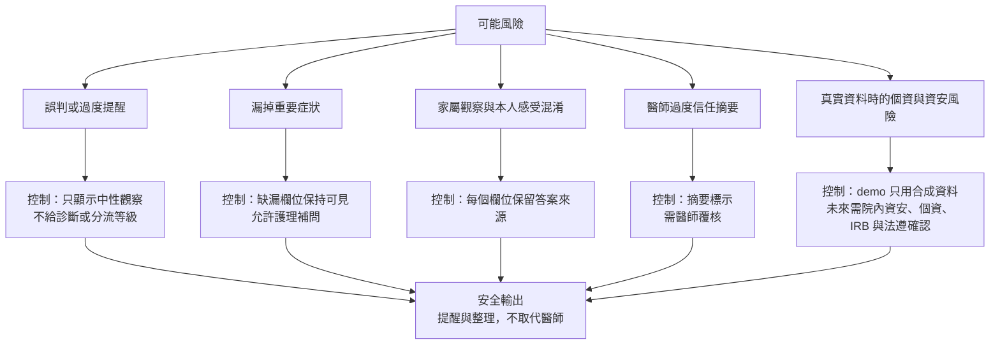

---

# 7️⃣ 臨床應用情境（Use Cases）

## 情境一：門診前頻尿/夜尿病史整理

問題：  
病人主訴晚上一直起床尿尿，但進診間時常難以清楚說明白天次數、夜尿次數、急尿頻率、睡前喝水/咖啡因情況，以及是否能配合 bladder diary。

系統如何介入：  
病人先完成簡短 guided questions，系統整理為 storage symptom summary：白天排尿是否增加、夜尿次數、急尿頻率、fluid/caffeine context、是否可記錄 3 天 diary，以及藥單是否完整。

帶來的改變：  
醫師進診間前可先知道病人主要困擾與資料完整度；護理師若流程允許，可提前說明 diary 或提醒帶藥單。系統不判斷 OAB，也不建議治療。

## 情境二：排尿困難與弱尿流的門診前整理

問題：  
病人或家屬說「尿不太出來」，但需要進一步釐清是否尿流弱、需用力、斷斷續續、尿不乾淨、是否現在完全尿不出來，以及用藥資訊是否可得。

系統如何介入：  
系統在主訴或核心題觸發 voiding/emptying 模組，整理病人回報的排空症狀，並把「曾經或目前尿不出來」以中性 review statement 顯示給護理/醫師。

帶來的改變：  
醫師可以快速抓到排空症狀組合，並知道哪些內容是本人回答、哪些是家屬協助操作。系統只提示「需臨床 review」，不自動決定急迫性、不建議導尿、不判斷 BPH。

## 情境三：漏尿但資料不完整的護理補問

問題：  
漏尿病人可能因尷尬或家屬代填而回答不完整；例如知道有漏尿，但缺少發生多久、漏尿量、有無尿痛/發燒、藥單是否完整等資訊。

系統如何介入：  
系統保留已知資訊，例如漏尿頻率、誘發情境、是否使用護墊，同時清楚列出缺漏欄位。護理工作台顯示具體補問項目，並保留家屬觀察與病人本人感受的區分。

帶來的改變：  
護理師可以用最少問題補足最重要缺漏；醫師看到摘要時，不會誤以為資料完整，也能知道病人可能因尷尬而需要更溫和的問診方式。

圖 9：三個明天 demo 可直接使用的臨床情境。

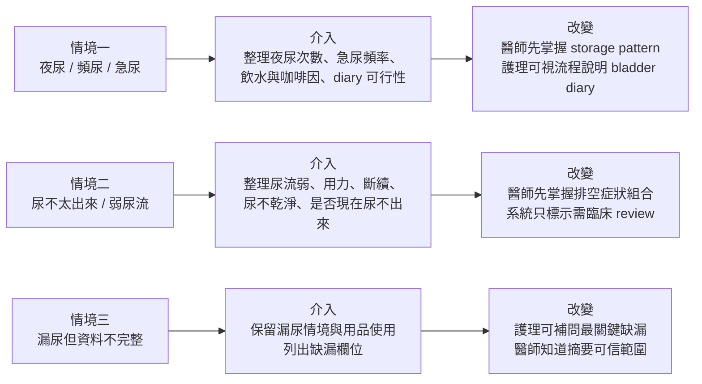

---

# 8️⃣ 導入方式與未來發展（Implementation & Future）

## 8.1 建議導入方式

第一階段應維持為低風險、非整合式的臨床 review：

- 使用合成案例與醫師/護理師進行流程審查。
- 確認摘要格式是否真的能在一分鐘內閱讀。
- 確認護理補問是否符合實際門診動線。
- 確認哪些 review statements 有院內 SOP，哪些不應突出顯示。
- 確認台灣臨床端偏好的正式量表：IPSS、OABSS、ICIQ 或院內自訂表單。

第二階段才考慮小範圍可用性測試：

- 只針對特定場景，例如夜尿/頻尿、男性 LUTS、漏尿、或家屬協助填答族群。
- 先以紙本或離線流程模擬，不直接寫入病歷。
- 收集完成率、缺漏率、醫師閱讀時間、護理補問負擔、醫師是否願意保留摘要欄位。

第三階段若要接近臨床試用，才評估：

- 真實資料治理與病人同意。
- 院內資安與權限控管。
- 與 HIS/EMR/EHR 的整合必要性。
- 是否涉及醫療器材軟體或 AI/ML SaMD 相關法規。
- 臨床成效指標，例如問診時間、病史完整度、護理補問效率、病人滿意度。

圖 10：從明天 demo 到未來臨床試用的保守導入路徑。

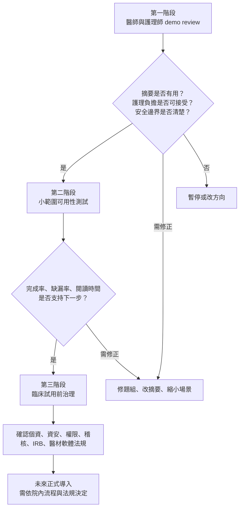

## 8.2 可擴展方向

- 男性 LUTS / BPH 模組：可評估是否納入完整 IPSS 或正式授權量表。
- 女性尿失禁模組：可評估完整 ICIQ 或院內常用 questionnaire。
- 血尿 pathway：可加入吸菸史、抗凝血藥、職業暴露等，但應由醫師確認風險分層。
- 反覆感染症狀整理：可整理症狀發作史與尿液檢查資訊，但不做 UTI 診斷。
- 語言與可近用性：台語口語輔助、大字體、高對比、朗讀、家屬協助模式。
- 紙本/櫃台/護理站版本：讓流程可以先適配現場，而不是一開始就要求完整系統整合。

---

# 9️⃣ Demo 說明引導（給明天簡報用）

## 9.1 開場 60 秒建議說法

「今天想請各位看的不是一個會診斷的 AI，而是一個泌尿科門診前的資訊整理流程。它讓病人或家屬先用簡單問題描述主訴、症狀型態、困擾程度與用藥完整性；系統會保留答案來源、列出缺漏，讓護理師可以補問，最後產生醫師一分鐘內可以掃讀的摘要。整個 demo 只用合成資料，不連病歷，不做診斷、不分流、不建議治療。今天最想請醫師判斷的是：這樣的摘要是否真的有機會減少重複問診、提升病史完整度，並且能安全融入門診流程。」

## 9.2 建議展示順序

1. 先講安全邊界
   - 合成資料。
   - 不診斷、不分流、不治療。
   - 醫師覆核必須保留。

2. 展示病人/家屬端
   - 大按鈕、簡短題目、可回答不確定。
   - 顯示家屬可協助操作，但來源會被標記。
   - 說明病人端看不到護理、醫師、reviewer 工作台。

3. 選第一個合成案例：晚上常起床尿尿
   - 展示主訴、夜尿次數、急尿、咖啡因/睡前喝水、diary feasibility。
   - 問醫師：這些欄位哪些有用？哪些是雜訊？

4. 打開護理工作台
   - 展示缺漏或補問 cue。
   - 強調護理端不是診斷，而是把「下一個值得補問的欄位」顯示出來。

5. 打開醫師摘要
   - 只掃讀主訴、duration/bother、patient-reported pattern、missing information、source notes。
   - 問醫師：這份摘要能不能在進診間前或看診中使用？

6. 展示第二個案例：尿不太出來
   - 展示 voiding/emptying symptoms 與 review statement。
   - 強調不自動決定急迫性，不建議導尿，只提醒醫師/護理 review。

7. 展示第三個案例：漏尿但資料不完整
   - 讓醫師看到缺漏資訊如何保留。
   - 展示家屬觀察與病人主觀感受分開標示。

8. 最後收斂到導入討論
   - 這個流程最適合放在哪個 slot：報到、候診、護理 rooming、或看診前一天？
   - 哪些病人族群最適合先試：夜尿/頻尿、排尿困難、漏尿、家屬陪同長者？
   - 哪些欄位應保留、刪除或交給醫師問？
   - 下一步應該做 one-page summary mockup、修題組、護理流程測試，或先暫停？

圖 11：明天現場 demo 的建議講解順序。

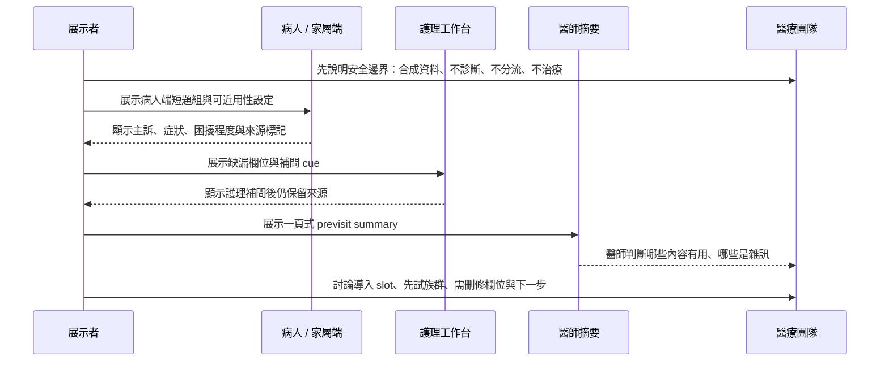

## 9.3 建議現場問醫師的問題

- 這份摘要哪一行會讓您比較快進入問診？
- 哪些內容您不會看，或會覺得干擾？
- 缺漏資訊要補到什麼程度才值得交給醫師？
- 家屬來源標記對您有沒有幫助？
- 哪些症狀應該只顯示為 observation，不能被系統突出成警示？
- 護理師在目前 workflow 中是否有時間補問藥單或 bladder diary？
- 第一個可行試點應該是病人自填、家屬協助填，還是護理師主導？

---

# 參考依據（供臨床討論核對）

- AUA/SUFU. The AUA/SUFU Guideline on the Diagnosis and Treatment of Idiopathic Overactive Bladder (2024). https://www.auanet.org/guidelines-and-quality/guidelines/idiopathic-overactive-bladder
- AUA/SUFU. Microhematuria Guideline (2025 update). https://www.auanet.org/guidelines-and-quality/guidelines/microhematuria
- AUA/CUA/SUFU. Recurrent Uncomplicated Urinary Tract Infections in Women Guideline (2025). https://www.auanet.org/guidelines-and-quality/guidelines/recurrent-uti
- AUA. Management of Lower Urinary Tract Symptoms Attributed to Benign Prostatic Hyperplasia Guideline. https://www.auanet.org/guidelines-and-quality/guidelines/benign-prostatic-hyperplasia-(bph)-guideline
- NICE CG97. Lower urinary tract symptoms in men: management. https://www.nice.org.uk/guidance/cg97/chapter/recommendations
- NICE NG123. Urinary incontinence and pelvic organ prolapse in women: management. https://www.nice.org.uk/guidance/ng123/chapter/recommendations
- International Continence Society. Bladder diary / frequency volume chart terminology. https://www.ics.org/committees/standardisation/terminologydiscussions/bladderdiary
- ICIQ. International Consultation on Incontinence Questionnaire-Urinary Incontinence Short Form. https://iciq.net/iciq-ui-sf
- AHRQ. Health Literacy Universal Precautions Toolkit. https://www.ahrq.gov/health-literacy/improve/precautions/index.html
- CDC. Health Literacy Communication Strategies. https://www.cdc.gov/health-literacy/php/research-summaries/communication-strategies.html
- FDA. Human Factors and Medical Devices. https://www.fda.gov/medical-devices/device-advice-comprehensive-regulatory-assistance/human-factors-and-medical-devices
- HHS. HIPAA mobile health privacy guidance. https://www.hhs.gov/hipaa/for-professionals/privacy/guidance/cell-phone-hipaa/index.html
- 衛生福利部。強化病人安全管理機制，為病人就醫安全把關。https://www.mohw.gov.tw/cp-2704-19692-1.html

---

# 附註：本 demo 明確不宣稱的事項

- 不宣稱已完成臨床驗證。
- 不宣稱可改善臨床 outcome。
- 不宣稱可取代既有初診單或病歷。
- 不宣稱可診斷 OAB、BPH、UTI、尿失禁類型、血尿風險或 urinary retention。
- 不宣稱已符合任一院所正式門診流程。
- 不宣稱可使用真實病人資料。
- 不宣稱已完成台灣病人可讀性驗證。
