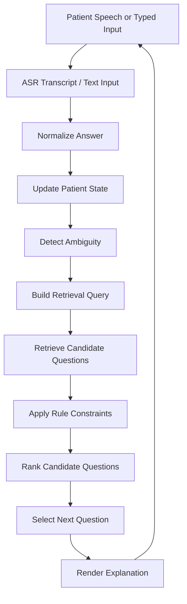

# Urology AI Previsit Demo V2 Spec

## 0. One-Line Definition

V2 is an ASR-ready adaptive previsit questioning demo that uses a governed urology question bank and embedding-style retrieval/ranking to select the next most useful question after each patient answer.

中文定位：

V2 是一個「AI 輔助門診前病史蒐集系統」：病人每回答一次，系統就重新計算目前資訊狀態，從受治理的泌尿科題庫中選出下一個最合理問題。

## 1. Product Goal

### 1.1 Core Problem

Patients often cannot describe symptoms precisely before a visit.

Examples:

```text
我尿尿怪怪的
我下面會痛
我晚上一直起來尿
好像有點刺刺的
我也不知道是不是尿道痛
```

These answers can be clinically useful, but they are not structured enough for efficient clinician review.

V2's goal is:

```text
把病人的自然語言回答，逐步轉成醫師可閱讀、可使用、可追問的結構化病史資訊。
```

### 1.2 What V2 Must Demonstrate

V2 must show that:

1. The patient can answer in natural language.
2. The system can accept ASR transcript or typed input.
3. The system maintains current patient state.
4. The system knows what has been answered and what is missing.
5. The system retrieves candidate next questions from a governed bank.
6. The system ranks candidate questions.
7. The system selects the next most reasonable question.
8. The system explains why that question was selected.
9. When patient wording is unclear, the system asks a clarification question first.
10. The system does not diagnose, recommend treatment, or freely generate medical questions.

## 2. V1 to V2 Difference

### 2.1 V1

V1 is a fixed-flow questionnaire.

```text
Question 1 -> Question 2 -> Question 3 -> Question 4 -> Summary
```

Traits:

```text
- fixed question order
- fixed path
- mainly demonstrates previsit question UI
- similar to a digital form
```

Limitation:

```text
病人回答不同，下一題仍然大致相同。
AI 價值不明顯。
醫院端可能會覺得這只是電子問卷。
```

### 2.2 V2

V2 is adaptive questioning.

```text
Patient answer
-> update state
-> detect ambiguity
-> retrieve candidate questions
-> rank questions
-> select next best question
-> explain selection
```

Traits:

```text
- 題序不是固定
- 每次回答後重新計算
- 下一題由 ranking engine 選出
- 題目來自受治理題庫
- 可解釋為什麼選這一題
- LLM 暫不進 runtime
```

Core difference:

```text
V1: 展示問卷流程
V2: 展示 AI 如何選下一題
```

## 3. System Boundary

### 3.1 In Scope

```text
- ASR-ready input interface
- typed input fallback
- urology question bank
- patient state tracking
- ambiguity detection
- embedding-style retrieval
- deterministic ranking
- next-question selection
- explanation panel
- three demo cases
- test cases
- 5-minute demo script
```

### 3.2 Out of Scope

```text
- LLM runtime
- free-form clinical question generation
- diagnosis
- treatment recommendation
- medication recommendation
- exam ordering
- HIS / EMR / EHR integration
- real patient data
- production clinical deployment
- final medical decision support
```

### 3.3 Safety Boundary

V2 must obey:

```text
1. 所有問題都必須來自 governed question bank。
2. 系統不能自由生成新醫療問題。
3. 系統不能說「你可能得了 X 疾病」。
4. 系統不能建議藥物、檢查、治療。
5. 系統只能協助蒐集門診前資訊。
6. red flag 只能提示「需要醫療人員進一步評估」。
7. 模糊回答必須先澄清，不可以強行分類。
```

## 4. First-Principle Design

### 4.1 Fundamental Job

The system's fundamental job is not to answer patient questions.

Its job is:

```text
Reduce ambiguity.
Fill missing clinical history fields.
Prepare useful previsit information for clinician review.
```

中文：

```text
降低模糊性。
補足病史缺口。
讓醫師更快掌握病人狀況。
```

### 4.2 Core Loop

```text
One answer -> one state update -> one best next question
```

Each round should do one thing:

```text
根據目前資訊，找出下一個最有價值的問題。
```

## 5. Architecture Overview

### 5.1 High-Level Flow



### 5.2 Runtime Layers

```text
Layer 1: Input Layer
- ASR input
- typed fallback

Layer 2: Normalization Layer
- clean transcript
- detect keywords
- map natural language to symptom hints

Layer 3: Patient State Layer
- answered slots
- missing slots
- detected symptoms
- ambiguity status
- red flag hints
- previous questions

Layer 4: Question Bank Layer
- governed urology questions
- metadata
- constraints

Layer 5: Retrieval Layer
- embedding-style similarity
- keyword-vector hybrid
- candidate selection

Layer 6: Ranking Layer
- score candidate questions
- apply penalties
- select top question

Layer 7: Explanation Layer
- why selected
- what was matched
- what gap it fills
- why others were skipped
```

## 6. Repository Structure

Current implemented structure:

```text
app/adaptive-intake/
  index.html
  adaptive-intake.js
  adaptive-intake.css

core/adaptive_questioning/
  index.js
  questionBank.js
  extractFacts.js
  detectAmbiguity.js
  scoring.js
  rankQuestions.js
  constants.js
  normalize.js
  state.js
  ambiguity.js
  retrieve.js
  rank.js
  explain.js

data/question_bank/
  urology_adaptive_bank.js

docs/
  urology-ai-previsit-demo-v2-spec.md
  v1-to-v2-change-log.md
  adaptive-questioning-design.md
  ambiguity-handling.md
  question-bank-schema.md
  safety-boundary.md
  demo-script-5min.md
```

`questionBank.js` remains the canonical browser-runtime bank. The
`data/question_bank/urology_adaptive_bank.js` file re-exports the same governed
bank so the spec-shaped data path does not drift from the route used in the
demo. The `normalize`, `state`, `ambiguity`, `retrieve`, `rank`, and `explain`
modules are thin adapters around the existing deterministic engine.

## 7. Main Route

Route:

```text
/app/adaptive-intake/
```

Do not break:

```text
/app/patient-short/
```

V1 remains separate. V2 is independent.

Page title:

```text
Urology Previsit Adaptive Intake Demo
```

Subtitle:

```text
AI-assisted next-question selection from a governed urology question bank
```

## 8. UI Spec

### 8.1 Layout

Three panels:

```text
Left Panel: Patient Input / Transcript
Center Panel: Current Question / Answer Flow
Right Panel: AI Reasoning / Ranking Explanation
```

### 8.2 Left Panel

Shows:

```text
- ASR status
- typed input box
- submitted answers
- transcript history
```

Typed fallback must always remain available.

### 8.3 Center Panel

Shows:

```text
- current question
- question category or purpose
- answer options if available
- progress indicator
- previous selected questions where useful
```

### 8.4 Right Panel

The right panel is the most important V2 evidence surface.

It shows:

```text
- detected facts
- missing information
- ambiguity status
- top 3 candidate questions
- selected question
- reason for selection
- skipped / penalized reasons
- safety boundary note
```

## 9. Data Model

### 9.1 Patient State Schema

Conceptual schema:

```js
{
  sessionId: "demo-session-001",
  turnIndex: 2,
  rawAnswers: [
    {
      questionId: "chief_complaint_open",
      questionText: "What brings you here today?",
      answerText: "I wake up many times at night to pee.",
      source: "typed",
      timestamp: "2026-05-12T10:00:00+08:00"
    }
  ],
  detectedSymptoms: [
    {
      label: "nocturia",
      confidence: 0.86,
      evidence: "wake up many times at night to pee"
    }
  ],
  possibleDomains: ["storage_symptoms"],
  answeredSlots: ["chief_complaint"],
  missingSlots: ["duration", "nocturia_count", "urgency", "dysuria", "hematuria", "fever", "flank_pain"],
  ambiguity: {
    status: "clear",
    type: null,
    notes: []
  },
  redFlags: [],
  askedQuestionIds: ["chief_complaint_open"],
  currentStateText: "Patient reports waking up many times at night to urinate. Known: nocturia. Missing: duration, nocturia count, urgency, pain, blood in urine, fever."
}
```

The current implementation returns a compact state object from `rankQuestions`, including symptoms, answered fields, missing fields, state text, ambiguity details, and ambiguity status.

### 9.2 Question Bank Schema

Each exported question should expose:

```js
{
  id: "nocturia_count",
  text: "How many times do you usually wake up at night to urinate?",
  type: "quantification",
  asksFor: ["nocturia_count"],
  symptoms: ["nocturia", "frequency", "urgency"],
  domain: "storage_symptoms",
  clinicalValue: 0.9,
  ambiguityReduction: 0.7,
  safetyPriority: 0.2,
  redFlag: false,
  nextUsefulWhen: [
    "patient mentions waking at night to urinate",
    "patient reports urinary frequency",
    "nocturia_count is missing"
  ],
  avoidWhen: [
    "nocturia_count already answered"
  ],
  answerType: "single_choice",
  options: ["Once", "Two times", "Three or more times", "Not sure"],
  explanationTemplate: "This question quantifies nocturia severity and fills a missing field useful for clinician review."
}
```

## 10. Question Types

The V2 question bank should support:

```text
open_text
single_choice
multi_choice
yes_no
duration
severity_scale
clarification
red_flag_check
closing
```

## 11. Urology Question Categories

The first governed bank should include at least 40 questions and cover:

```text
chief complaint
duration
frequency / nocturia
urgency
dysuria
hematuria
fever / systemic symptoms
flank pain
lower abdominal pain
ambiguous pain clarification
past history
medication / context
closing
```

## 12. Ambiguity Handling Spec

### 12.1 Ambiguity States

```text
clear
ambiguous
conflicting
insufficient
```

The current implementation directly supports `clear` and `ambiguous`. The design reserves `conflicting` and `insufficient` for future expansion.

### 12.2 Clear

Example:

```text
It burns when I pee.
```

State:

```js
{
  status: "clear",
  detectedSymptoms: ["dysuria"]
}
```

### 12.3 Ambiguous

Example:

```text
It hurts down there.
```

State:

```js
{
  status: "ambiguous",
  ambiguityType: "pain_location_unspecified",
  possibleInterpretations: [
    "urethral_pain",
    "genital_pain",
    "lower_abdominal_pain",
    "flank_pain"
  ]
}
```

Next question:

```text
Where do you feel the pain most clearly?
```

### 12.4 Conflicting

Example:

```text
Turn 1: No pain.
Turn 3: It burns when I pee.
```

Future behavior:

```text
Just to clarify, do you currently feel pain or burning when urinating?
```

### 12.5 Insufficient

Example:

```text
I'm not sure.
```

Future behavior:

```text
Did this start today, within the past week, or more than a week ago?
```

## 13. Retrieval Spec

### 13.1 Current State Text

After every answer, the system builds current state text.

Example:

```text
Patient reports waking up at night to urinate and sometimes has urgency. Known symptoms: nocturia, urgency. Missing fields: duration, nocturia count, pain, blood in urine, fever.
```

This text is used for retrieval-style matching.

### 13.2 Candidate Retrieval

V2 uses deterministic hybrid retrieval:

```text
semantic score = symptom vector similarity + keyword match + slot gap match
```

It does not require a large external embedding model for the demo.

### 13.3 Retrieval Input

```js
{
  currentStateText,
  detectedSymptoms,
  missingSlots,
  ambiguity,
  redFlags,
  askedQuestionIds
}
```

### 13.4 Retrieval Output

```js
[
  {
    questionId: "nocturia_count",
    rawSimilarity: 0.82,
    matchedSymptoms: ["nocturia"],
    matchedMissingSlots: ["nocturia_count"]
  },
  {
    questionId: "duration_general",
    rawSimilarity: 0.74,
    matchedMissingSlots: ["duration"]
  }
]
```

## 14. Ranking Spec

### 14.1 Scoring Formula

```text
score =
  semantic_similarity * 0.40
+ unanswered_gap_value * 0.25
+ clinical_workflow_value * 0.20
+ ambiguity_reduction * 0.10
+ safety_priority * 0.05
- already_answered_penalty
- out_of_scope_penalty
- repetition_penalty
```

### 14.2 Factor Meaning

| Factor | Meaning |
| --- | --- |
| semantic_similarity | Whether the question matches current patient state |
| unanswered_gap_value | Whether it fills currently missing information |
| clinical_workflow_value | Whether it is useful for clinician-facing history |
| ambiguity_reduction | Whether it reduces vague or unclear wording |
| safety_priority | Whether it checks red-flag boundary information |
| already_answered_penalty | Penalizes already answered questions |
| out_of_scope_penalty | Penalizes questions outside urology/demo scope |
| repetition_penalty | Prevents repeated or near-duplicate questions |

### 14.3 Ranking Output

Conceptual output:

```js
{
  selectedQuestion: {
    id: "nocturia_count",
    text: "How many times do you usually wake up at night to urinate?"
  },
  topCandidates: [
    {
      id: "nocturia_count",
      score: 0.86,
      reasons: [
        "Matched symptom: nocturia",
        "Fills missing slot: nocturia_count",
        "High clinical workflow value"
      ]
    }
  ],
  penalizedCandidates: [
    {
      id: "chief_complaint_open",
      penalty: "already_asked"
    }
  ]
}
```

## 15. Explanation Spec

The explanation panel should be short and understandable to hospital stakeholders.

Fields:

```js
{
  selectedReason: "...",
  matchedFacts: [],
  missingSlotsFilled: [],
  ambiguityNotes: [],
  safetyNotes: [],
  skippedReasons: []
}
```

Example:

```text
Selected Question:
How many times do you usually wake up at night to urinate?

Why selected:
The patient mentioned waking at night to urinate. This question quantifies nocturia severity and fills a missing field useful for clinician review.

Matched facts:
- waking at night to urinate

Missing field filled:
- nocturia_count

Skipped:
- Chief complaint question skipped because it was already answered.
```

## 16. Demo Cases

### 16.1 Case A: Nocturia / Frequency

Initial answer:

```text
I wake up several times at night to pee.
```

Expected flow:

```text
1. How many times do you usually wake up at night to urinate?
2. How long has this been happening?
3. Do you also urinate more often during the day?
4. Do you feel a sudden urge to urinate?
5. Have you noticed blood in your urine?
```

Demo value:

```text
Shows symptom quantification and progressive gap filling.
```

### 16.2 Case B: Dysuria

Initial answer:

```text
It burns when I pee.
```

Expected flow:

```text
1. How long have you felt burning when urinating?
2. Do you need to urinate more often than usual?
3. Do you have fever or chills?
4. Do you feel pain in your back or side?
5. Have you noticed blood in your urine?
```

Demo value:

```text
Shows symptom-specific follow-up and red-flag boundary checks.
```

### 16.3 Case C: Ambiguous Pain

Initial answer:

```text
I feel pain down there.
```

Expected flow:

```text
1. Where do you feel the pain most clearly?
2. Does the pain happen during urination?
3. Is the pain in the lower abdomen, around the genitals, or in the back or side?
4. How long has this pain been present?
5. Have you had fever, blood in urine, or severe pain?
```

Demo value:

```text
Shows ambiguity handling. This should be the strongest case for V2.
```

## 17. ASR Spec

ASR is the input layer, not the core AI claim.

Core claim:

```text
ASR transcript -> patient state -> next question ranking
```

Requirements:

```text
- ASR optional
- typed fallback mandatory
- ASR transcript editable before submit
- system should not auto-submit uncertain ASR transcript
```

UI behavior:

```text
1. User clicks Start Voice Input.
2. ASR transcript appears.
3. User can edit transcript.
4. User clicks Submit Answer.
5. System updates patient state.
6. System selects next question.
```

## 18. LLM Policy

LLM is not in the V2 runtime.

```text
No LLM API call.
No LLM-generated medical question.
No LLM-generated diagnosis.
No LLM-generated treatment advice.
```

Future LLM role:

```text
- clinician-facing summary
- language rewriting
- bilingual explanation
- patient-friendly wording
- structured report generation
```

Next-question selection should remain governed by the deterministic ranking engine.

## 19. Safety Copy

Recommended UI safety copy:

```text
This demo supports previsit information collection only. It does not diagnose, recommend treatment, or replace clinician judgment.
```

Chinese:

```text
本系統僅用於門診前資訊蒐集展示，不提供診斷、治療建議，也不取代醫療人員判斷。
```

## 20. Test Spec

Functional tests:

```text
1. Nocturia input selects nocturia_count or duration.
2. Dysuria input selects dysuria detail, duration, frequency, or fever.
3. Ambiguous pain input selects a clarification question.
4. Already asked questions are not repeated.
5. Red-flag terms increase safety-priority questions.
6. Outputs contain no diagnosis or treatment recommendation.
```

## 21. Acceptance Criteria

### 21.1 Product Acceptance

```text
- V2 has a separate adaptive-intake route.
- V1 remains unchanged.
- User can complete three demo cases.
- System selects next question dynamically.
- System displays top 3 candidate questions.
- System explains why one question was selected.
- System handles vague pain with clarification.
- System avoids repeated questions.
- No LLM runtime is used.
- No diagnosis or treatment recommendation appears.
```

### 21.2 Demo Acceptance

```text
- 5-minute demo can run smoothly.
- Demo works with typed input.
- ASR is optional.
- No external API is required.
- Backup flow exists.
- Three cases are pre-scripted.
```

### 21.3 Engineering Acceptance

```text
- Core logic is separated from UI.
- Question bank is data-driven.
- Ranking function is testable.
- Explanation function is testable.
- Safety tests pass.
- Existing app routes are not broken.
```

## 22. Five-Minute Demo Script

Use `docs/demo-script-5min.md` as the current script.

Opening:

```text
Version 1 was a fixed-path questionnaire.
Version 2 shows adaptive questioning.

After each patient answer, the system updates the current patient state, checks what information is still missing, retrieves candidate questions from a governed urology question bank, ranks them, and selects the most useful next question.
```

Strongest case:

```text
Patient says:
I feel pain down there.

System marks:
ambiguous pain location

System selects clarification:
Where do you feel the pain most clearly?
```

Key sentence:

```text
When the patient is unclear, the system does not over-interpret. It asks a clarification question first.
```

## 23. Recommended Implementation Order

1. Write docs and lock boundary.
2. Build question bank.
3. Build core engine.
4. Build UI.
5. Add tests.
6. Freeze live route, typed fallback, three cases, demo script, and backup video.

## 24. Codex Prompt

Use this prompt when recreating the work from scratch:

```text
Build version 2 of the urology-ai-previsit demo.

Goal:
Create an ASR-ready adaptive questioning demo that selects the next best urology previsit question using a governed question bank and deterministic embedding-style retrieval/ranking.

Do not integrate an LLM into runtime.
Do not generate free-form medical questions.
Do not diagnose.
Do not recommend treatment.
All questions must come from the governed question bank.

Create a new route:
app/adaptive-intake/

Do not break existing routes.

Core engine flow:
1. receive answer
2. normalize answer
3. update patient state
4. detect ambiguity
5. build current state text
6. retrieve candidate questions
7. rank candidates
8. select next question
9. explain selection

Ranking formula:
score =
semantic_similarity * 0.40
+ unanswered_gap_value * 0.25
+ clinical_workflow_value * 0.20
+ ambiguity_reduction * 0.10
+ safety_priority * 0.05
- already_answered_penalty
- out_of_scope_penalty
- repetition_penalty
```

## 25. Final Positioning

Do not position V2 as a medical chatbot.

Correct positioning:

```text
AI-guided previsit question navigation system
```

Chinese:

```text
AI 輔助門診前問答導航系統
```

Core value:

```text
病人自然回答。
系統更新狀態。
系統找資訊缺口。
系統從題庫選下一題。
系統解釋為什麼選這題。
模糊時先澄清。
全程不診斷。
```
